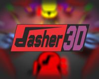
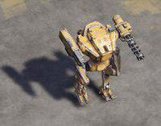
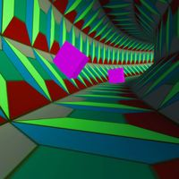

# Action Games

## Dasher 3D

**Category:** Action

A top-down shooter with innovative time-freezing mechanics. Navigate through minimalist 3D environments while time only moves when you move. Plan your attacks carefully as enemies and their projectiles only advance when you do, creating a unique puzzle-like combat experience.

**How to Play:** Use a single button (mouse click or space) to move forward in the direction you're facing. Time only progresses when you move, allowing you to plan your path through enemy fire. Rotate your view with the mouse to change direction. Reach the exit in each level while avoiding or eliminating enemies.

[▶ Play Game](https://esyverse.itch.io/dasher)

---

## Robostorm.io

**Category:** Action

An online multiplayer robot battle game built with PlayCanvas. Control a customizable robot in arena-style combat against other players. Features various weapons, power-ups, and robot parts that can be unlocked and upgraded as you progress through matches.

**How to Play:** Use WASD or arrow keys to move your robot. Mouse to aim and left-click to fire your weapons. Collect power-ups scattered around the arena to gain temporary advantages. Destroy enemy robots to earn points and resources, which can be used to upgrade your robot between matches. Last robot standing wins!

[▶ Play Game](https://robostorm.io/)

---

## Tunnel Rush

**Category:** Action

A fast-paced 3D tunnel avoidance game built with Babylon.js. Speed through colorful geometric tunnels while avoiding obstacles that appear in your path. Features increasing difficulty, vibrant visuals with color-changing environments, and an adrenaline-pumping soundtrack.

**How to Play:** Use left and right arrow keys or A/D to rotate the tunnel and avoid hitting obstacles. The game automatically propels you forward at increasing speeds. In two-player mode, each player controls half of the screen. React quickly to navigate through gaps in the obstacles and survive as long as possible.

[▶ Play Game](https://poki.com/en/g/tunnel-rush)

---

