# All Games

## 3D Tank Battle

**Category:** FPS

An intense multiplayer tank battle game in 3D. Battle against other players in real-time tank combat with realistic physics and explosive action.

**How to Play:** Use WASD or arrow keys to drive your tank, tank turrets auto-fire. On mobile, use the virtual joystick to move!

[▶ Play Game](https://3dtankbattle.com)

---

## Bruno Simon Portfolio

**Category:** Other

An interactive 3D portfolio where you drive a car through a playful environment

**How to Play:** Use WASD or arrow keys to drive the car. Click and drag to look around. On mobile, use the virtual joystick!

[▶ Play Game](https://bruno-simon.com/)

---

## Bullet Force

**Category:** FPS

A modern multiplayer FPS with realistic graphics and a wide variety of weapons. Experience intense combat with multiple game modes, customizable loadouts, and special abilities.

**How to Play:** Use WASD to move, mouse to aim, and click to shoot. Press R to reload, Space to jump, and C to crouch. On mobile, use the virtual joystick and buttons. Earn kill streaks to unlock special abilities!

[▶ Play Game](https://www.crazygames.com/game/bullet-force-multiplayer)

---

## Bullet Fury 2

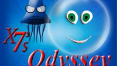

**Category:** FPS

A 3D first-person shooter with arcade-style gameplay. Battle through various levels filled with enemies using a variety of weapons. Features fast-paced action, power-ups, and boss fights in a stylized 3D environment designed to run smoothly in browsers.

**How to Play:** Use WASD to move, mouse to aim, and left-click to shoot. Press Space to jump, Shift to sprint, and R to reload. Collect new weapons and power-ups throughout levels to increase your combat effectiveness. Eliminate all enemies in each area to progress through the game.

[▶ Play Game](https://www.newgrounds.com/portal/view/673609)

---

## Dasher 3D

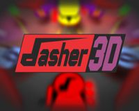

**Category:** Action

A top-down shooter with innovative time-freezing mechanics. Navigate through minimalist 3D environments while time only moves when you move. Plan your attacks carefully as enemies and their projectiles only advance when you do, creating a unique puzzle-like combat experience.

**How to Play:** Use a single button (mouse click or space) to move forward in the direction you're facing. Time only progresses when you move, allowing you to plan your path through enemy fire. Rotate your view with the mouse to change direction. Reach the exit in each level while avoiding or eliminating enemies.

[▶ Play Game](https://esyverse.itch.io/dasher)

---

## Drift Hunters

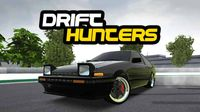

**Category:** Racing

A realistic 3D drifting game with a focus on authentic drift mechanics and car customization. Features a variety of real-world inspired cars that can be upgraded and tuned for optimal drifting performance. Earn points by performing stylish drifts across multiple tracks and environments.

**How to Play:** Use WASD or arrow keys to control your car: W/Up to accelerate, S/Down to brake/reverse, A/D or Left/Right to steer. Space for handbrake to initiate drifts. Earn money from successful drifts to upgrade your car's performance and appearance. Master the art of controlling your car through corners while maintaining a drift for maximum points.

[▶ Play Game](https://www.crazygames.com/game/drift-hunters)

---

## Farm Clash 3D

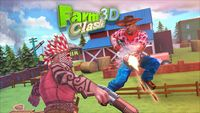

**Category:** FPS

A unique third-person shooter set in a colorful farm environment. Battle against other players using farm-themed weapons and characters in various game modes. Features team-based gameplay, multiple maps, and a lighthearted, humorous approach to the shooter genre.

**How to Play:** Use WASD to move, Space to jump, and Shift to sprint. Mouse to aim and left-click to shoot. Press R to reload and Q/E to switch weapons. On mobile, use the virtual joystick and on-screen buttons. Work with your team to defeat the opposing team and complete objectives.

[▶ Play Game](https://www.crazygames.com/game/farm-clash-3d)

---

## Fields of Fury

**Category:** FPS

A World War II-themed capture the flag FPS built with PlayCanvas. Battle against other players in team-based matches across historically inspired maps. Features multiple soldier classes, authentic weapons, and vehicles from the era in a fast-paced multiplayer environment.

**How to Play:** Use WASD to move, Space to jump, and Shift to sprint. Mouse to aim and left-click to shoot. Press E to interact with objects or enter vehicles. Choose your class and work with your team to capture the enemy flag while defending your own. Use period-appropriate weapons and tactics to secure victory.

[▶ Play Game](https://play.fieldsoffury.io/)

---

## Fly.Pieter.com

**Category:** Simulator

A fun free-to-play MMO flight sim, made with AI. Fly and dogfight with your friends online.

**How to Play:** Fly your plane with the controls on your keyboard or using the virtual joystick on mobile

[▶ Play Game](https://fly.pieter.com)

---

## HexGL

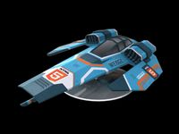

**Category:** Racing

A futuristic racing game inspired by F-Zero and Wipeout. Race through stunning neon tracks in this WebGL-powered game, featuring smooth controls and high-speed action.

**How to Play:** Use arrow keys to control your hovercraft. Up/Down to accelerate/brake, Left/Right to steer. On mobile, use the virtual joystick. Collect power-ups and race against the clock!

[▶ Play Game](https://hexgl.bkcore.com/)

---

## Interland

**Category:** Other

An educational 3D game by Google that teaches kids about online safety through interactive adventures. Explore four different lands while learning about digital citizenship, security, and kindness.

**How to Play:** Use WASD or arrow keys to move around. Click to interact with objects and complete challenges. On mobile, use the virtual joystick and tap to interact. Follow the on-screen instructions to complete each level.

[▶ Play Game](https://beinternetawesome.withgoogle.com/en_us/interland)

---

## Kirka.io

**Category:** FPS

A block-style FPS with different game modes including team deathmatch, free-for-all, and capture the flag. Features a variety of weapons, character customization, and maps with a distinctive voxel aesthetic. Earn experience and currency to unlock new items and upgrades as you play.

**How to Play:** Use WASD to move, Space to jump, and Shift to sprint. Mouse to aim and left-click to shoot. Press R to reload and Q for special abilities. Numbers 1-9 to switch weapons. On mobile, use the virtual joystick and buttons. Choose your preferred game mode and work with your team or dominate solo depending on the mode.

[▶ Play Game](https://kirka.io)

---

## Krunker.io

**Category:** FPS

A fast-paced first-person shooter with low-poly graphics and advanced movement mechanics. Choose from multiple classes with unique abilities and weapons, customize your character, and compete in various game modes. Known for its quick matches and skill-based gameplay.

**How to Play:** Use WASD to move, Space to jump, and Shift to crouch. Mouse to aim and click to shoot. Advanced players use slide-hopping (jump + crouch while moving) for faster movement. On mobile, use the virtual controls to move and shoot.

[▶ Play Game](https://krunker.io)

---

## Madalin Stunt Cars 2

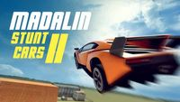

**Category:** Racing

An open-world stunt driving game with a selection of high-performance cars and large maps to explore. Perform incredible stunts, drifts, and jumps across multiple detailed environments. Features multiplayer mode where you can show off your driving skills to other players.

**How to Play:** Use WASD or arrow keys to drive: W/Up to accelerate, S/Down to brake/reverse, A/D or Left/Right to steer. Press Space for handbrake to drift. R to reset your car if you get stuck. On mobile, use the on-screen controls. Explore the maps freely and challenge yourself to perform impressive stunts.

[▶ Play Game](https://www.crazygames.com/game/madalin-stunt-cars-2)

---

## Madalin Stunt Cars 3

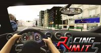

**Category:** Racing

The latest installment in the Madalin Stunt Cars series with improved graphics, physics, and more vehicles. Race and perform stunts in exotic supercars across expansive, detailed maps. Features multiplayer functionality allowing you to drive alongside friends and show off your best tricks.

**How to Play:** Use WASD or arrow keys to drive: W/Up to accelerate, S/Down to brake/reverse, A/D or Left/Right to steer. Press Space for handbrake to drift. R to reset your car if you get stuck. On mobile, use the on-screen controls. Explore the maps and challenge yourself to perform the most impressive stunts possible.

[▶ Play Game](https://www.crazygames.com/game/madalin-stunt-cars-3)

---

## Mini Royale: Nations

**Category:** FPS

A browser-based FPS with social strategy elements built on PlayCanvas. Combines fast-paced first-person shooter action with base building and resource management. Features multiple game modes, weapon customization, and a persistent world where players can form alliances.

**How to Play:** Use WASD to move, Space to jump, and Shift to sprint. Mouse to aim and left-click to shoot. Press R to reload and E to interact with objects. Combat takes place in first-person shooter matches, while the strategic layer involves building and upgrading your base, managing resources, and forming alliances with other players.

[▶ Play Game](https://miniroyale.io/)

---

## Moon Rider

**Category:** Other

A musical rhythm game where you surf a cosmic road, built with A-Frame for WebXR. Slash through targets and dodge obstacles in time with the music. Features multiple game modes, a large library of songs, and support for both VR headsets and standard browser play with impressive 3D visuals.

**How to Play:** In browser mode, use your mouse to slash through targets in the direction indicated. In VR mode, use your controllers to cut targets and dodge obstacles. Choose from different game modes including classic, punch, and ride modes. Select from a variety of songs with different difficulty levels and enjoy the immersive audio-visual experience.

[▶ Play Game](https://moonrider.xyz)

---

## Narrow One

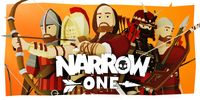

**Category:** FPS

A unique multiplayer first-person archery game with a minimalist art style. Compete in team-based capture-the-flag matches using bow and arrow as your primary weapon. Features multiple character classes, maps, and strategic gameplay focused on precision and teamwork.

**How to Play:** Use WASD to move, Space to jump, and Shift to sprint. Hold left mouse button to draw your bow and release to shoot. Right-click to zoom/aim. Press Q/E to switch abilities. On mobile, use the virtual joystick and on-screen buttons. Work with your team to capture the enemy flag while defending your own.

[▶ Play Game](https://narrow.one)

---

## Neuro Cookie Quest 3D

**Category:** Platformer

A fan-made 3D platformer created for the Neuro-sama game jam. Guide the character through colorful levels collecting cookies while avoiding obstacles and enemies. Features charming low-poly graphics, platforming challenges, and puzzle elements in a compact game experience.

**How to Play:** Use WASD or arrow keys to move, Space to jump, and Shift to sprint. Collect all the cookies in each level to progress. Navigate platforms, avoid hazards, and solve simple puzzles to reach your goal. The game combines classic platforming mechanics with a cute aesthetic in a browser-friendly package.

[▶ Play Game](https://kerneliron.itch.io/neuro-cookie-quest-3d)

---

## Om Nom: Run

**Category:** Other

A colorful 3D endless runner featuring the lovable character Om Nom from the Cut the Rope series. Run through vibrant environments, collect candies, avoid obstacles, and use power-ups to achieve high scores in this family-friendly arcade game.

**How to Play:** Swipe left or right to change lanes, swipe up to jump, and swipe down to slide. On desktop, use arrow keys or WASD. Collect candies for points and power-ups to help you progress further. Avoid obstacles to keep running as long as possible!

[▶ Play Game](https://www.crazygames.com/game/om-nom-run)

---

## Pixel Warfare

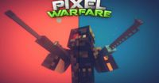

**Category:** FPS

A fast-paced multiplayer FPS game with pixel graphics. Battle against other players in various game modes with a wide selection of weapons and maps. The blocky, retro aesthetic combines with modern FPS gameplay for a unique shooting experience.

**How to Play:** Use WASD to move, mouse to aim, and click to shoot. Press R to reload, Space to jump, and Shift to sprint. On mobile, use the virtual joystick and buttons to control your character and weapons.

[▶ Play Game](https://www.crazygames.com/game/pixel-warfare)

---

## Plume

**Category:** Adventure

A beautiful third-person adventure game with a unique art style and stunning visual effects. Explore a mysterious world and solve puzzles in this atmospheric experience.

**How to Play:** Use WASD to move, mouse to look around, and click to interact with objects. On mobile, use the virtual joystick and tap to interact. Collect items and solve puzzles to progress through the story.

[▶ Play Game](https://plumegame.com/)

---

## PolyTrack

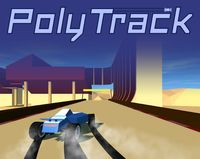

**Category:** Racing

A low-poly 3D racing game with a built-in track editor. Race through colorful tracks in arcade-style gameplay with drift mechanics and time trials. Create and share your own tracks with the community, featuring an intuitive track editor and multiple vehicle options.

**How to Play:** Use WASD or arrow keys to control your vehicle: W/Up to accelerate, S/Down to brake/reverse, A/D or Left/Right to steer. Hold Space to drift. On mobile, use the on-screen controls. Race against the clock in time trials or create your own tracks in the editor mode.

[▶ Play Game](https://kodub.itch.io/polytrack)

---

## Robostorm.io

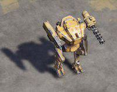

**Category:** Action

An online multiplayer robot battle game built with PlayCanvas. Control a customizable robot in arena-style combat against other players. Features various weapons, power-ups, and robot parts that can be unlocked and upgraded as you progress through matches.

**How to Play:** Use WASD or arrow keys to move your robot. Mouse to aim and left-click to fire your weapons. Collect power-ups scattered around the arena to gain temporary advantages. Destroy enemy robots to earn points and resources, which can be used to upgrade your robot between matches. Last robot standing wins!

[▶ Play Game](https://robostorm.io/)

---

## Rocket Bot Royale

**Category:** Battle Royale

A side-scrolling tank battle game with a focus on physics and destruction. Control a tank equipped with rockets and other weapons, battling against other players in a last-tank-standing format. Features destructible terrain, power-ups, and strategic gameplay in a 2D environment with 3D graphics.

**How to Play:** Use A/D or Left/Right arrows to move your tank. Adjust your firing angle with W/S or Up/Down. Press Space to fire your weapon. Collect power-ups and coins to upgrade your tank and weapons. The rising water level forces players to move upward as the match progresses. Be the last tank surviving to win!

[▶ Play Game](https://rocketbotroyale.com)

---

## RuneScape

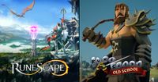

**Category:** RPG

The iconic MMORPG with a browser-accessible version. Explore the vast fantasy world of Gielinor with thousands of other players. Features hundreds of quests, dozens of skills to master, PvP combat, player-driven economy, and regular content updates in a persistent online world with 20+ years of development.

**How to Play:** Use mouse clicks to move, interact with objects, and attack enemies. Access skills, inventory, and other menus through the interface. Choose between the modern RS3 version or Old School RuneScape for a classic experience. Create a character and develop various skills like combat, crafting, and magic while completing quests and interacting with other players.

[▶ Play Game](https://www.runescape.com/)

---

## SWOOOP

**Category:** Other

A beautiful 3D flying game built with PlayCanvas where you pilot a biplane through a colorful island environment. Collect coins, fly through rings, and avoid obstacles in this arcade-style flying game with simple one-button controls and smooth gameplay.

**How to Play:** Press and hold the mouse button or touch the screen to climb, release to dive. On mobile, simply tap and hold anywhere on the screen. Collect coins for points and fly through rings for speed boosts. Avoid obstacles like mountains and trees!

[▶ Play Game](https://playcanv.as/p/JtL2iqIH/)

---

## Shell Shockers

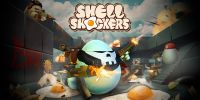

**Category:** FPS

A unique multiplayer FPS where you play as an egg character in intense arena battles. Choose from various weapons and compete against other players in this quirky and fun shooter.

**How to Play:** Use WASD to move, mouse to aim, and click to shoot. On mobile, use the virtual joystick and buttons. Choose your weapon and try to crack your opponents' shells!

[▶ Play Game](https://shellshock.io/)

---

## Smash Karts

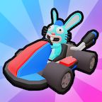

**Category:** Racing

A chaotic multiplayer kart racing game with power-ups and battle elements. Race and battle against other players in colorful arenas, collecting weapons and power-ups to take out opponents. Features simple controls, vibrant graphics, and fast-paced gameplay suitable for all ages.

**How to Play:** Use WASD or arrow keys to drive your kart: W/Up to accelerate, S/Down to brake/reverse, A/D or Left/Right to steer. Drive over power-up boxes to collect weapons, then click or press Space to use them. Earn points by taking out other players and surviving longer than your opponents. Last kart standing wins!

[▶ Play Game](https://smashkarts.io)

---

## Summer Afternoon

**Category:** Other

A beautiful multiplayer 3D environment with a unique cartoon-style aesthetic. Explore this peaceful world with other players, featuring stunning shaders and a relaxing atmosphere.

**How to Play:** Use WASD or arrow keys to move around. Click and drag to look around. On mobile, use the virtual joystick and touch to look around. Join other players in this shared space!

[▶ Play Game](https://summer-afternoon.vlucendo.com/)

---

## Temple Run 2

**Category:** Other

The web version of the popular endless runner game where you escape from temple guardians through ancient ruins. Run, jump, slide and turn through challenging terrain while collecting coins and power-ups. Features beautiful 3D environments and increasingly difficult obstacles.

**How to Play:** Swipe left or right to turn, swipe up to jump, and swipe down to slide. On desktop, use arrow keys: left/right to turn, up to jump, down to slide. Tilt your device (or use A/D keys) to move side to side for collecting coins. Avoid obstacles and run as far as possible!

[▶ Play Game](https://poki.com/en/g/temple-run-2)

---

## The Aviator

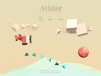

**Category:** Adventure

A stylish 3D game where you fly a plane through a colorful world, collecting items. Originally created as a Three.js tutorial, this game features beautiful low-poly visuals, smooth animations, and simple yet engaging gameplay in a vibrant environment.

**How to Play:** Use your mouse or touch input to control the plane's movement. Move the cursor left and right to steer the plane horizontally, up and down to control altitude. Collect the floating coins while avoiding obstacles. The game demonstrates core concepts of 3D web development with an appealing aesthetic.

[▶ Play Game](https://tympanus.net/codrops/2016/04/26/the-aviator-animating-basic-3d-scene-threejs/)

---

## The Cube

**Category:** Puzzle

An interactive 3D Rubik's Cube puzzle built with Three.js. Solve the classic puzzle in your browser with smooth animations and intuitive controls. Features customizable cube sizes from 2x2 to 5x5, multiple difficulty levels, and the ability to scramble and reset the cube.

**How to Play:** Click and drag on the cube faces to rotate them. Use the control panel to adjust settings like cube size and scramble difficulty. Solve the puzzle by aligning all colors on each face. For keyboard controls, use the arrow keys to rotate the cube view and WASD to rotate faces. A perfect demonstration of 3D manipulation in the browser.

[▶ Play Game](https://codepen.io/bsehovac/pen/EMyWVv)

---

## The Frantic Run Of The Valorous Rabbit

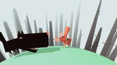

**Category:** Adventure

An endless runner where you control a rabbit on a spherical world. Built with Three.js, this charming game features a unique perspective as you guide your rabbit around a planet, avoiding obstacles and collecting items. The distinctive art style and creative gameplay mechanics showcase the capabilities of 3D web technologies.

**How to Play:** Use left and right arrow keys or A/D to move the rabbit around the planet. Jump with Space or the up arrow key to avoid obstacles. The game increases in difficulty as you progress, requiring quick reflexes and good timing. See how far you can run before hitting an obstacle!

[▶ Play Game](https://codepen.io/Yakudoo/pen/YGxYZj)

---

## Tunnel Rush

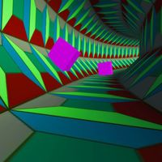

**Category:** Action

A fast-paced 3D tunnel avoidance game built with Babylon.js. Speed through colorful geometric tunnels while avoiding obstacles that appear in your path. Features increasing difficulty, vibrant visuals with color-changing environments, and an adrenaline-pumping soundtrack.

**How to Play:** Use left and right arrow keys or A/D to rotate the tunnel and avoid hitting obstacles. The game automatically propels you forward at increasing speeds. In two-player mode, each player controls half of the screen. React quickly to navigate through gaps in the obstacles and survive as long as possible.

[▶ Play Game](https://poki.com/en/g/tunnel-rush)

---

## Venge.io

**Category:** FPS

A fast-paced multiplayer first-person shooter with stunning 3D graphics built on PlayCanvas. Features multiple game modes, character classes, and weapons with unique abilities. Known for its smooth performance and competitive gameplay in a browser-based environment.

**How to Play:** Use WASD to move, Space to jump, and Shift to sprint. Mouse to aim and left-click to shoot, right-click for scope/aim. Press R to reload and Q for special abilities. On mobile, use the virtual joystick and on-screen buttons. Choose different weapons and classes to match your playstyle.

[▶ Play Game](https://venge.io)

---

## Vibesail

**Category:** Other

A relaxing 3D sailing experience where you navigate through beautiful waters and discover hidden islands. Perfect for unwinding and enjoying the peaceful atmosphere.

**How to Play:** Use WASD or arrow keys to control your sailboat. Adjust the sails to catch the wind and navigate through the waters. On mobile, use the virtual joystick!

[▶ Play Game](https://vibesail.com)

---

## War Brokers

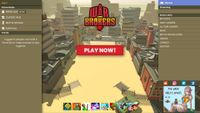

**Category:** FPS

A voxel-style first-person shooter with various vehicles and game modes. Engage in team battles, capture the flag, or battle royale modes with a unique blocky aesthetic. Features tanks, helicopters, and other vehicles alongside traditional FPS combat.

**How to Play:** Use WASD to move, Space to jump, and Shift to sprint. Mouse to aim and left-click to shoot. Press E to enter vehicles, Q for special abilities. On mobile, use the virtual controls. Work with your team to complete objectives or be the last player standing in battle royale mode.

[▶ Play Game](https://warbrokers.io)

---

## xx142-b2.exe

**Category:** Puzzle

A JS13kGames winner where you infiltrate an alien network as a virus. Navigate through a stylized representation of computer systems, avoiding detection while completing objectives. Features unique hacking mechanics, minimalist visuals, and an atmospheric soundtrack, all compressed into less than 13KB of JavaScript.

**How to Play:** Use WASD or arrow keys to move through the network. Press Space or E to interact with nodes and systems. Avoid detection by security measures and complete your objectives to progress. The game presents a series of increasingly difficult puzzles that require stealth and strategy to overcome.

[▶ Play Game](https://js13kgames.com/games/xx142-b2exe/index.html)

---

