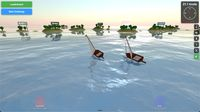

# All Games

## 3D Tank Battle

**Category:** FPS

An intense multiplayer tank battle game in 3D. Battle against other players in real-time tank combat with realistic physics and explosive action.

**How to Play:** Use WASD or arrow keys to drive your tank, tank turrets auto-fire. On mobile, use the virtual joystick to move!

[▶ Play Game](https://3dtankbattle.com)

---

## Bruno Simon Portfolio

**Category:** Other

An interactive 3D portfolio where you drive a car through a playful environment

**How to Play:** Use WASD or arrow keys to drive the car. Click and drag to look around. On mobile, use the virtual joystick!

[▶ Play Game](https://bruno-simon.com/)

---

## Fly.Pieter.com

**Category:** Simulator

A fun free-to-play MMO flight sim, made with AI. Fly and dogfight with your friends online.

**How to Play:** Fly your plane with the controls on your keyboard or using the virtual joystick on mobile

[▶ Play Game](https://fly.pieter.com)

---

## Vibesail

**Category:** Other

A relaxing 3D sailing experience where you navigate through beautiful waters and discover hidden islands. Perfect for unwinding and enjoying the peaceful atmosphere.

**How to Play:** Use WASD or arrow keys to control your sailboat. Adjust the sails to catch the wind and navigate through the waters. On mobile, use the virtual joystick!

[▶ Play Game](https://vibesail.com)

---

