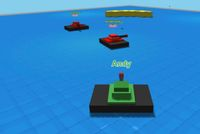

# All Games

## 3D Tank Battle

**Category:** FPS

An intense multiplayer tank battle game in 3D. Battle against other players in real-time tank combat with realistic physics and explosive action.

**How to Play:** Use WASD or arrow keys to drive your tank, tank turrets auto-fire. On mobile, use the virtual joystick to move!

[▶ Play Game](https://3dtankbattle.com)

---

## Bruno Simon Portfolio

**Category:** Other

An interactive 3D portfolio where you drive a car through a playful environment

**How to Play:** Use WASD or arrow keys to drive the car. Click and drag to look around. On mobile, use the virtual joystick!

[▶ Play Game](https://bruno-simon.com/)

---

## Bullet Force

**Category:** FPS

A modern multiplayer FPS with realistic graphics and a wide variety of weapons. Experience intense combat with multiple game modes, customizable loadouts, and special abilities.

**How to Play:** Use WASD to move, mouse to aim, and click to shoot. Press R to reload, Space to jump, and C to crouch. On mobile, use the virtual joystick and buttons. Earn kill streaks to unlock special abilities!

[▶ Play Game](https://www.crazygames.com/game/bullet-force-multiplayer)

---

## Fly.Pieter.com

**Category:** Simulator

A fun free-to-play MMO flight sim, made with AI. Fly and dogfight with your friends online.

**How to Play:** Fly your plane with the controls on your keyboard or using the virtual joystick on mobile

[▶ Play Game](https://fly.pieter.com)

---

## HexGL

**Category:** Racing

A futuristic racing game inspired by F-Zero and Wipeout. Race through stunning neon tracks in this WebGL-powered game, featuring smooth controls and high-speed action.

**How to Play:** Use arrow keys to control your hovercraft. Up/Down to accelerate/brake, Left/Right to steer. On mobile, use the virtual joystick. Collect power-ups and race against the clock!

[▶ Play Game](https://hexgl.bkcore.com/)

---

## Interland

**Category:** Other

An educational 3D game by Google that teaches kids about online safety through interactive adventures. Explore four different lands while learning about digital citizenship, security, and kindness.

**How to Play:** Use WASD or arrow keys to move around. Click to interact with objects and complete challenges. On mobile, use the virtual joystick and tap to interact. Follow the on-screen instructions to complete each level.

[▶ Play Game](https://beinternetawesome.withgoogle.com/en_us/interland)

---

## Plume

**Category:** Adventure

A beautiful third-person adventure game with a unique art style and stunning visual effects. Explore a mysterious world and solve puzzles in this atmospheric experience.

**How to Play:** Use WASD to move, mouse to look around, and click to interact with objects. On mobile, use the virtual joystick and tap to interact. Collect items and solve puzzles to progress through the story.

[▶ Play Game](https://plumegame.com/)

---

## Shell Shockers

**Category:** FPS

A unique multiplayer FPS where you play as an egg character in intense arena battles. Choose from various weapons and compete against other players in this quirky and fun shooter.

**How to Play:** Use WASD to move, mouse to aim, and click to shoot. On mobile, use the virtual joystick and buttons. Choose your weapon and try to crack your opponents' shells!

[▶ Play Game](https://shellshock.io/)

---

## Summer Afternoon

**Category:** Other

A beautiful multiplayer 3D environment with a unique cartoon-style aesthetic. Explore this peaceful world with other players, featuring stunning shaders and a relaxing atmosphere.

**How to Play:** Use WASD or arrow keys to move around. Click and drag to look around. On mobile, use the virtual joystick and touch to look around. Join other players in this shared space!

[▶ Play Game](https://summer-afternoon.vlucendo.com/)

---

## Vibesail

**Category:** Other

A relaxing 3D sailing experience where you navigate through beautiful waters and discover hidden islands. Perfect for unwinding and enjoying the peaceful atmosphere.

**How to Play:** Use WASD or arrow keys to control your sailboat. Adjust the sails to catch the wind and navigate through the waters. On mobile, use the virtual joystick!

[▶ Play Game](https://vibesail.com)

---

