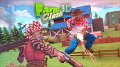
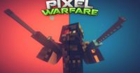

# FPS Games

## 3D Tank Battle

**Category:** FPS

An intense multiplayer tank battle game in 3D. Battle against other players in real-time tank combat with realistic physics and explosive action.

**How to Play:** Use WASD or arrow keys to drive your tank, tank turrets auto-fire. On mobile, use the virtual joystick to move!

[▶ Play Game](https://3dtankbattle.com)

---

## Bullet Force

**Category:** FPS

A modern multiplayer FPS with realistic graphics and a wide variety of weapons. Experience intense combat with multiple game modes, customizable loadouts, and special abilities.

**How to Play:** Use WASD to move, mouse to aim, and click to shoot. Press R to reload, Space to jump, and C to crouch. On mobile, use the virtual joystick and buttons. Earn kill streaks to unlock special abilities!

[▶ Play Game](https://www.crazygames.com/game/bullet-force-multiplayer)

---

## Bullet Fury 2

**Category:** FPS

A 3D first-person shooter with arcade-style gameplay. Battle through various levels filled with enemies using a variety of weapons. Features fast-paced action, power-ups, and boss fights in a stylized 3D environment designed to run smoothly in browsers.

**How to Play:** Use WASD to move, mouse to aim, and left-click to shoot. Press Space to jump, Shift to sprint, and R to reload. Collect new weapons and power-ups throughout levels to increase your combat effectiveness. Eliminate all enemies in each area to progress through the game.

[▶ Play Game](https://www.newgrounds.com/portal/view/673609)

---

## Farm Clash 3D

**Category:** FPS

A unique third-person shooter set in a colorful farm environment. Battle against other players using farm-themed weapons and characters in various game modes. Features team-based gameplay, multiple maps, and a lighthearted, humorous approach to the shooter genre.

**How to Play:** Use WASD to move, Space to jump, and Shift to sprint. Mouse to aim and left-click to shoot. Press R to reload and Q/E to switch weapons. On mobile, use the virtual joystick and on-screen buttons. Work with your team to defeat the opposing team and complete objectives.

[▶ Play Game](https://www.crazygames.com/game/farm-clash-3d)

---

## Fields of Fury

**Category:** FPS

A World War II-themed capture the flag FPS built with PlayCanvas. Battle against other players in team-based matches across historically inspired maps. Features multiple soldier classes, authentic weapons, and vehicles from the era in a fast-paced multiplayer environment.

**How to Play:** Use WASD to move, Space to jump, and Shift to sprint. Mouse to aim and left-click to shoot. Press E to interact with objects or enter vehicles. Choose your class and work with your team to capture the enemy flag while defending your own. Use period-appropriate weapons and tactics to secure victory.

[▶ Play Game](https://play.fieldsoffury.io/)

---

## Kirka.io

**Category:** FPS

A block-style FPS with different game modes including team deathmatch, free-for-all, and capture the flag. Features a variety of weapons, character customization, and maps with a distinctive voxel aesthetic. Earn experience and currency to unlock new items and upgrades as you play.

**How to Play:** Use WASD to move, Space to jump, and Shift to sprint. Mouse to aim and left-click to shoot. Press R to reload and Q for special abilities. Numbers 1-9 to switch weapons. On mobile, use the virtual joystick and buttons. Choose your preferred game mode and work with your team or dominate solo depending on the mode.

[▶ Play Game](https://kirka.io)

---

## Krunker.io

**Category:** FPS

A fast-paced first-person shooter with low-poly graphics and advanced movement mechanics. Choose from multiple classes with unique abilities and weapons, customize your character, and compete in various game modes. Known for its quick matches and skill-based gameplay.

**How to Play:** Use WASD to move, Space to jump, and Shift to crouch. Mouse to aim and click to shoot. Advanced players use slide-hopping (jump + crouch while moving) for faster movement. On mobile, use the virtual controls to move and shoot.

[▶ Play Game](https://krunker.io)

---

## Mini Royale: Nations

**Category:** FPS

A browser-based FPS with social strategy elements built on PlayCanvas. Combines fast-paced first-person shooter action with base building and resource management. Features multiple game modes, weapon customization, and a persistent world where players can form alliances.

**How to Play:** Use WASD to move, Space to jump, and Shift to sprint. Mouse to aim and left-click to shoot. Press R to reload and E to interact with objects. Combat takes place in first-person shooter matches, while the strategic layer involves building and upgrading your base, managing resources, and forming alliances with other players.

[▶ Play Game](https://miniroyale.io/)

---

## Narrow One

**Category:** FPS

A unique multiplayer first-person archery game with a minimalist art style. Compete in team-based capture-the-flag matches using bow and arrow as your primary weapon. Features multiple character classes, maps, and strategic gameplay focused on precision and teamwork.

**How to Play:** Use WASD to move, Space to jump, and Shift to sprint. Hold left mouse button to draw your bow and release to shoot. Right-click to zoom/aim. Press Q/E to switch abilities. On mobile, use the virtual joystick and on-screen buttons. Work with your team to capture the enemy flag while defending your own.

[▶ Play Game](https://narrow.one)

---

## Pixel Warfare

**Category:** FPS

A fast-paced multiplayer FPS game with pixel graphics. Battle against other players in various game modes with a wide selection of weapons and maps. The blocky, retro aesthetic combines with modern FPS gameplay for a unique shooting experience.

**How to Play:** Use WASD to move, mouse to aim, and click to shoot. Press R to reload, Space to jump, and Shift to sprint. On mobile, use the virtual joystick and buttons to control your character and weapons.

[▶ Play Game](https://www.crazygames.com/game/pixel-warfare)

---

## Shell Shockers

**Category:** FPS

A unique multiplayer FPS where you play as an egg character in intense arena battles. Choose from various weapons and compete against other players in this quirky and fun shooter.

**How to Play:** Use WASD to move, mouse to aim, and click to shoot. On mobile, use the virtual joystick and buttons. Choose your weapon and try to crack your opponents' shells!

[▶ Play Game](https://shellshock.io/)

---

## Venge.io

**Category:** FPS

A fast-paced multiplayer first-person shooter with stunning 3D graphics built on PlayCanvas. Features multiple game modes, character classes, and weapons with unique abilities. Known for its smooth performance and competitive gameplay in a browser-based environment.

**How to Play:** Use WASD to move, Space to jump, and Shift to sprint. Mouse to aim and left-click to shoot, right-click for scope/aim. Press R to reload and Q for special abilities. On mobile, use the virtual joystick and on-screen buttons. Choose different weapons and classes to match your playstyle.

[▶ Play Game](https://venge.io)

---

## War Brokers

**Category:** FPS

A voxel-style first-person shooter with various vehicles and game modes. Engage in team battles, capture the flag, or battle royale modes with a unique blocky aesthetic. Features tanks, helicopters, and other vehicles alongside traditional FPS combat.

**How to Play:** Use WASD to move, Space to jump, and Shift to sprint. Mouse to aim and left-click to shoot. Press E to enter vehicles, Q for special abilities. On mobile, use the virtual controls. Work with your team to complete objectives or be the last player standing in battle royale mode.

[▶ Play Game](https://warbrokers.io)

---

