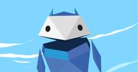
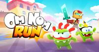
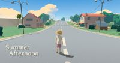
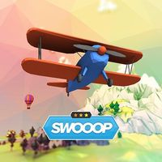
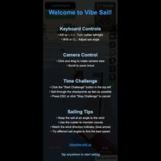

# Other Games

## Bruno Simon Portfolio

**Category:** Other

An interactive 3D portfolio where you drive a car through a playful environment

**How to Play:** Use WASD or arrow keys to drive the car. Click and drag to look around. On mobile, use the virtual joystick!

[▶ Play Game](https://bruno-simon.com/)

---

## Interland

**Category:** Other

An educational 3D game by Google that teaches kids about online safety through interactive adventures. Explore four different lands while learning about digital citizenship, security, and kindness.

**How to Play:** Use WASD or arrow keys to move around. Click to interact with objects and complete challenges. On mobile, use the virtual joystick and tap to interact. Follow the on-screen instructions to complete each level.

[▶ Play Game](https://beinternetawesome.withgoogle.com/en_us/interland)

---

## Moon Rider

**Category:** Other

A musical rhythm game where you surf a cosmic road, built with A-Frame for WebXR. Slash through targets and dodge obstacles in time with the music. Features multiple game modes, a large library of songs, and support for both VR headsets and standard browser play with impressive 3D visuals.

**How to Play:** In browser mode, use your mouse to slash through targets in the direction indicated. In VR mode, use your controllers to cut targets and dodge obstacles. Choose from different game modes including classic, punch, and ride modes. Select from a variety of songs with different difficulty levels and enjoy the immersive audio-visual experience.

[▶ Play Game](https://moonrider.xyz)

---

## Om Nom: Run

**Category:** Other

A colorful 3D endless runner featuring the lovable character Om Nom from the Cut the Rope series. Run through vibrant environments, collect candies, avoid obstacles, and use power-ups to achieve high scores in this family-friendly arcade game.

**How to Play:** Swipe left or right to change lanes, swipe up to jump, and swipe down to slide. On desktop, use arrow keys or WASD. Collect candies for points and power-ups to help you progress further. Avoid obstacles to keep running as long as possible!

[▶ Play Game](https://www.crazygames.com/game/om-nom-run)

---

## Summer Afternoon

**Category:** Other

A beautiful multiplayer 3D environment with a unique cartoon-style aesthetic. Explore this peaceful world with other players, featuring stunning shaders and a relaxing atmosphere.

**How to Play:** Use WASD or arrow keys to move around. Click and drag to look around. On mobile, use the virtual joystick and touch to look around. Join other players in this shared space!

[▶ Play Game](https://summer-afternoon.vlucendo.com/)

---

## SWOOOP

**Category:** Other

A beautiful 3D flying game built with PlayCanvas where you pilot a biplane through a colorful island environment. Collect coins, fly through rings, and avoid obstacles in this arcade-style flying game with simple one-button controls and smooth gameplay.

**How to Play:** Press and hold the mouse button or touch the screen to climb, release to dive. On mobile, simply tap and hold anywhere on the screen. Collect coins for points and fly through rings for speed boosts. Avoid obstacles like mountains and trees!

[▶ Play Game](https://playcanv.as/p/JtL2iqIH/)

---

## Temple Run 2

**Category:** Other

The web version of the popular endless runner game where you escape from temple guardians through ancient ruins. Run, jump, slide and turn through challenging terrain while collecting coins and power-ups. Features beautiful 3D environments and increasingly difficult obstacles.

**How to Play:** Swipe left or right to turn, swipe up to jump, and swipe down to slide. On desktop, use arrow keys: left/right to turn, up to jump, down to slide. Tilt your device (or use A/D keys) to move side to side for collecting coins. Avoid obstacles and run as far as possible!

[▶ Play Game](https://poki.com/en/g/temple-run-2)

---

## Vibesail

**Category:** Other

A relaxing 3D sailing experience where you navigate through beautiful waters and discover hidden islands. Perfect for unwinding and enjoying the peaceful atmosphere.

**How to Play:** Use WASD or arrow keys to control your sailboat. Adjust the sails to catch the wind and navigate through the waters. On mobile, use the virtual joystick!

[▶ Play Game](https://vibesail.com)

---

