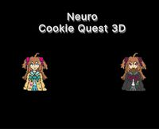

# Platformer Games

## Neuro Cookie Quest 3D

**Category:** Platformer

A fan-made 3D platformer created for the Neuro-sama game jam. Guide the character through colorful levels collecting cookies while avoiding obstacles and enemies. Features charming low-poly graphics, platforming challenges, and puzzle elements in a compact game experience.

**How to Play:** Use WASD or arrow keys to move, Space to jump, and Shift to sprint. Collect all the cookies in each level to progress. Navigate platforms, avoid hazards, and solve simple puzzles to reach your goal. The game combines classic platforming mechanics with a cute aesthetic in a browser-friendly package.

[▶ Play Game](https://kerneliron.itch.io/neuro-cookie-quest-3d)

---

