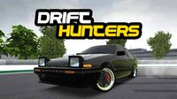
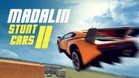
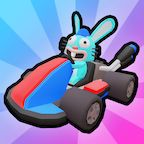

# Racing Games

## Drift Hunters

**Category:** Racing

A realistic 3D drifting game with a focus on authentic drift mechanics and car customization. Features a variety of real-world inspired cars that can be upgraded and tuned for optimal drifting performance. Earn points by performing stylish drifts across multiple tracks and environments.

**How to Play:** Use WASD or arrow keys to control your car: W/Up to accelerate, S/Down to brake/reverse, A/D or Left/Right to steer. Space for handbrake to initiate drifts. Earn money from successful drifts to upgrade your car's performance and appearance. Master the art of controlling your car through corners while maintaining a drift for maximum points.

[▶ Play Game](https://www.crazygames.com/game/drift-hunters)

---

## HexGL

**Category:** Racing

A futuristic racing game inspired by F-Zero and Wipeout. Race through stunning neon tracks in this WebGL-powered game, featuring smooth controls and high-speed action.

**How to Play:** Use arrow keys to control your hovercraft. Up/Down to accelerate/brake, Left/Right to steer. On mobile, use the virtual joystick. Collect power-ups and race against the clock!

[▶ Play Game](https://hexgl.bkcore.com/)

---

## Madalin Stunt Cars 2

**Category:** Racing

An open-world stunt driving game with a selection of high-performance cars and large maps to explore. Perform incredible stunts, drifts, and jumps across multiple detailed environments. Features multiplayer mode where you can show off your driving skills to other players.

**How to Play:** Use WASD or arrow keys to drive: W/Up to accelerate, S/Down to brake/reverse, A/D or Left/Right to steer. Press Space for handbrake to drift. R to reset your car if you get stuck. On mobile, use the on-screen controls. Explore the maps freely and challenge yourself to perform impressive stunts.

[▶ Play Game](https://www.crazygames.com/game/madalin-stunt-cars-2)

---

## Madalin Stunt Cars 3

**Category:** Racing

The latest installment in the Madalin Stunt Cars series with improved graphics, physics, and more vehicles. Race and perform stunts in exotic supercars across expansive, detailed maps. Features multiplayer functionality allowing you to drive alongside friends and show off your best tricks.

**How to Play:** Use WASD or arrow keys to drive: W/Up to accelerate, S/Down to brake/reverse, A/D or Left/Right to steer. Press Space for handbrake to drift. R to reset your car if you get stuck. On mobile, use the on-screen controls. Explore the maps and challenge yourself to perform the most impressive stunts possible.

[▶ Play Game](https://www.crazygames.com/game/madalin-stunt-cars-3)

---

## PolyTrack

**Category:** Racing

A low-poly 3D racing game with a built-in track editor. Race through colorful tracks in arcade-style gameplay with drift mechanics and time trials. Create and share your own tracks with the community, featuring an intuitive track editor and multiple vehicle options.

**How to Play:** Use WASD or arrow keys to control your vehicle: W/Up to accelerate, S/Down to brake/reverse, A/D or Left/Right to steer. Hold Space to drift. On mobile, use the on-screen controls. Race against the clock in time trials or create your own tracks in the editor mode.

[▶ Play Game](https://kodub.itch.io/polytrack)

---

## Smash Karts

**Category:** Racing

A chaotic multiplayer kart racing game with power-ups and battle elements. Race and battle against other players in colorful arenas, collecting weapons and power-ups to take out opponents. Features simple controls, vibrant graphics, and fast-paced gameplay suitable for all ages.

**How to Play:** Use WASD or arrow keys to drive your kart: W/Up to accelerate, S/Down to brake/reverse, A/D or Left/Right to steer. Drive over power-up boxes to collect weapons, then click or press Space to use them. Earn points by taking out other players and surviving longer than your opponents. Last kart standing wins!

[▶ Play Game](https://smashkarts.io)

---

